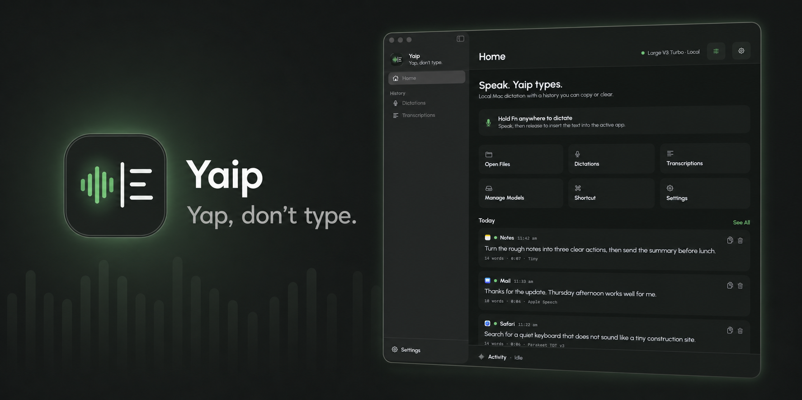
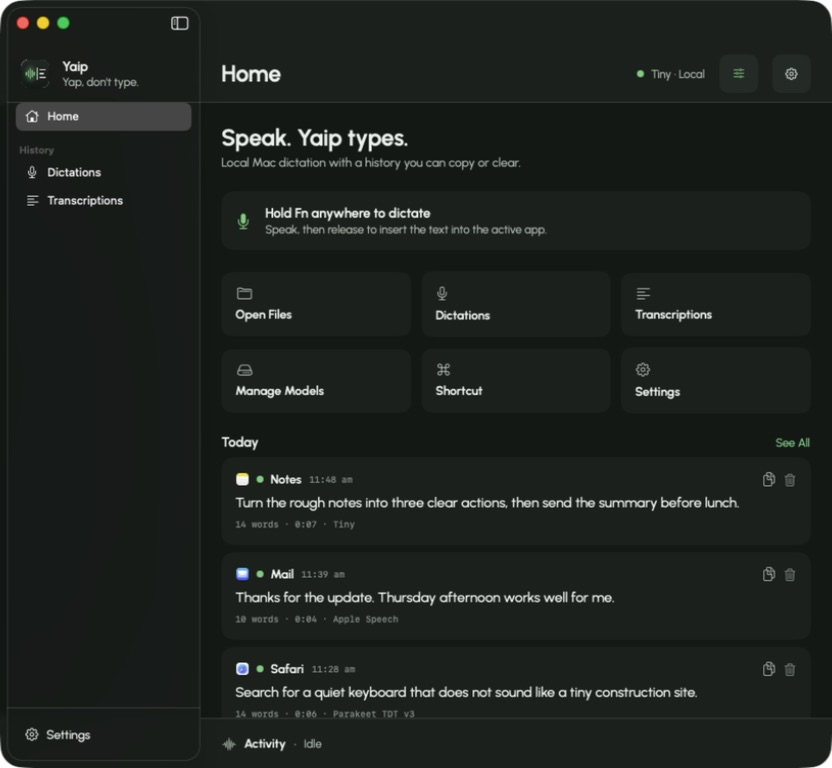
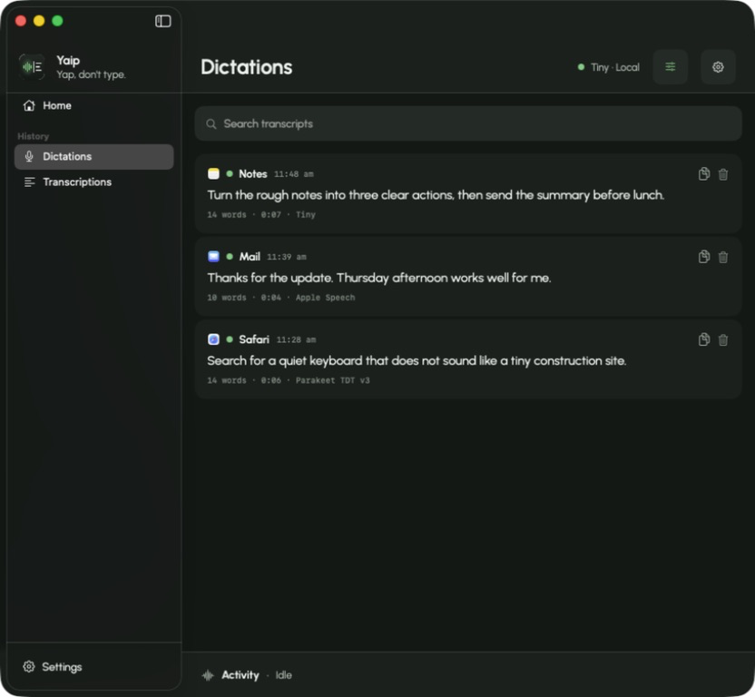
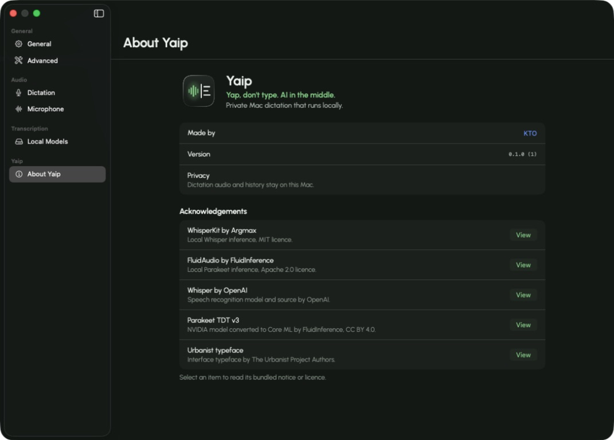

<p align="center">
  
</p>

<h1 align="center">Yaip</h1>

<p align="center">
  <strong>Yap, don't type.</strong><br>
  Private, local Mac dictation with recoverable history and no subscription.
</p>

<p align="center">
  <a href="https://github.com/kevtoe/yaip/releases/latest"></a>
  <a href="https://github.com/kevtoe/yaip/actions/workflows/test.yml"></a>
  <a href="LICENSE"></a>
  
</p>

---

Hold your shortcut, speak, and Yaip inserts the result into the active app. If
you need it later, every dictation remains in a simple local history where it
can be copied or deleted.

No account. No subscription. No remote transcription.

## What it does

- Global push-to-talk or toggle dictation
- Text insertion into the app you were using
- Recoverable dictation history
- File transcription by opening or dropping media
- Apple Speech, bundled Whisper Tiny, downloadable local models and compatible
  imported model folders
- Native SwiftUI interface for Apple Silicon Macs

## Screenshots

| Speak, then carry on | Keep useful dictations | Know what is running |
| --- | --- | --- |
|  |  |  |

## Privacy by default

Dictation audio and history stay on your Mac. Yaip has no analytics, account or
remote transcription service. Network access is used only when you explicitly
download a local model.

## Download and set up

Yaip requires macOS 14 or later on an Apple Silicon Mac.

1. Download the latest Apple Silicon DMG from
   [Releases](https://github.com/kevtoe/yaip/releases/latest).
2. Drag Yaip to Applications.
3. Open Yaip from Applications and complete its permission checklist.
4. Return to Yaip, click **Check Again**, then **Finish Setup**.
5. Use the shortcut shown on Home, speak, then release or toggle it again.

### Why Yaip needs permission

| macOS permission | What Yaip uses it for |
| --- | --- |
| Microphone | Captures your voice only while dictation is active. |
| Accessibility | Returns focus and inserts the finished text into the app you were using. |
| Input Monitoring | Detects your dictation shortcut while another app is active. |

If a permission was denied, open **System Settings > Privacy & Security**,
select the relevant permission, enable Yaip, then reopen the app if macOS asks.

The download is signed with a Developer ID and notarised by Apple. Audio and
dictation history remain local. Yaip connects to the internet only when you
choose to download another local model.

## Build from source

Install Xcode and [XcodeGen](https://github.com/yonaskolb/XcodeGen), then run:

```bash
brew install xcodegen
./Scripts/build.sh test
./Scripts/build.sh build
```

The debug app is written to Xcode's DerivedData directory. Release and signing
details are in [DISTRIBUTION.md](DISTRIBUTION.md).

## Models and acknowledgements

Yaip uses Apple Speech,
[WhisperKit](https://github.com/argmaxinc/WhisperKit) and
[FluidAudio](https://github.com/FluidInference/FluidAudio). The first release
bundles a pinned Whisper Tiny Core ML model so dictation works without a model
download. Relevant licences and notices are included in the app and under
`Resources/Licences`.

## Credit

Created by [KTO](https://github.com/kevtoe). Contributions are welcome.

## Licence

[MIT](LICENSE) © 2026 KTO. Third-party components and models retain their own
licences.
